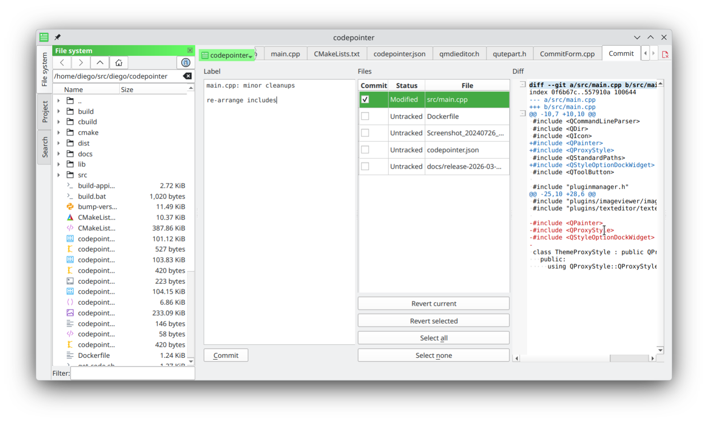

**Full Changelog**: <https://github.com/diegoiast/codepointer/codepointer/v0.1.2...v0.1.3-alpha1>

# March 2026 - release v0.1.3 - sssiiixxxx seeevveeeennn!!111

1. Git commit updates. The commit editor is the same as the main editor
   making the commits easier. All keyboard shorcuts and completions will work
2. When searching in fiels - the amount of times the text is found, will be
   dislpayed.
3.

## Changelog

* FileSystemBrowser: back/prev buttons on mouse do not work as expected - <https://github.com/diegoiast/qmdilib/issues/35>
* Ruby indenter test does not work - <https://github.com/diegoiast/qutepart-cpp/issues/48>
* Open matching header file improvements - <https://github.com/codepointerapp/codepointer/issues/178>
* Folding: strurcts are not folded properly - <https://github.com/diegoiast/qutepart-cpp/issues/68>
* Close all command not available via palette - <https://github.com/codepointerapp/codepointer/issues/179>
* changing json config on the fly does not refelect on the ide - <https://github.com/codepointerapp/codepointer/issues/167>
* Projet search: display amount of apperances of text - <https://github.com/codepointerapp/codepointer/issues/182>
* git: multiple cursors not working on commit dialog - <https://github.com/codepointerapp/codepointer/issues/181>
* Extend file formatters - <https://github.com/codepointerapp/codepointer/issues/174>
